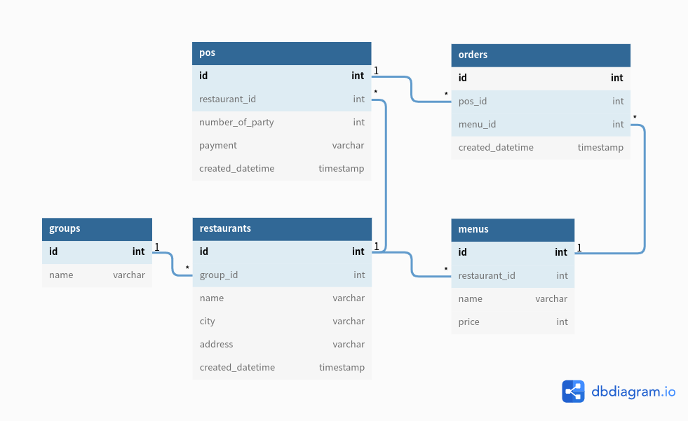

# BearRobotics
<div align="center">
  
  

  

  
</div>


` 프로젝트 수행 기간 2022-05-02 ~ 2022-05-09`

[Trello 링크](https://trello.com/b/p5wi33w9/robotics)


## 1. 가상환경 설치 및 실행
```shell
# virtualvenv 설치
> sudo pip install virtualenv

# 가상환경을 위한 디렉토리
> python3 -m virtualenv [디렉토리명]

# 또는
> virtualenv -p python3 [디렉토리명]

# 가상환경 활성화
> source [디렉토리명]/bin/activate

# django 프레임워크 설치
> pip3 install django

# 가상환경 비활성화
> deactivate

# 패키지 목록 출력
> pip freeze

# 패키지 목록을 requirements.txt에 저장
> pip freeze > requirements.txt

# requirements.txt 패키지 설치
> pip3 install -r requirements.txt
```

## 2. [Project Progress](https://github.com/orgs/PreOnboarding-Team-C/projects/2/views/1)

본 프로젝트에서는 None, Todo, In Progress, Done으로 나누어 공유가 가능하도록 합니다. 중요도는 상황에 따라 상대적으로 부여될 수 있기에, 담당자의 판단 하에 priorities를 설정해주시길 바랍니다.

---

### Tasks
#### Infos
* Terms 
  * POS: Point of sale 
  * RDB: Relational Database such as MySQL, PostgreSQL, SQLite
  * KPI: Key Performance Indicator

* DATASET
  | id | timestamp | restaurant | price | number_of_party | paymkent | conversion |
  |------------|-----|-------|------|------|------------|-------|

  주어진 데이터 셋의 칼럼명은 위와 같다.

* ERD


* 요구사항 정의
    - [x] Pos CRUD
    - [x] Menu CRUD
    - [x] Groups CRUD / Restaurant CRUD
    - [x] Pos CRUD
    - [x] KPI - Restaurant
        - Must
            - HOUR, DAY, WEEK, MONTH, YEAR
        - Option
            - start_time & end_time
            - price range (min_price, max_price)
            - number of party (min_party, max_party)
            - group
    - [x] Payment 별 KPI
        - Must
            - HOUR, DAY, WEEK, MONTH, YEAR
        - Option
            - start_time & end_time
            - price range (min_price, max_price)
            - number of party (min_party, max_party)
            - group
    - [x] Number of Party 별 KPI
        - Must
            - HOUR, DAY, WEEK, MONTH, YEAR
        - Option
            - start_time & end_time
            - price range (min_price, max_price)
            - number of party (min_party, max_party)
            - group

---
### Roles
* Groups CRUD / Restaurant CRUD, Number of Party 별 KPI (assignee: [@Bruno-Jang](https://github.com/Bruno-Jang))
* Menu CRUD, Payment 별 KPI (assignee: [@do-not-do-that](https://github.com/do-not-do-that))
* 개발 환경 구축, Pos CRUD, KPI - Restaurant(assignee: [@castela0119](https://github.com/castela0119))
* KPI - Restaurant (assignee: [@AshbeeKim](https://github.com/AshbeeKim))

## 3. API 명세
